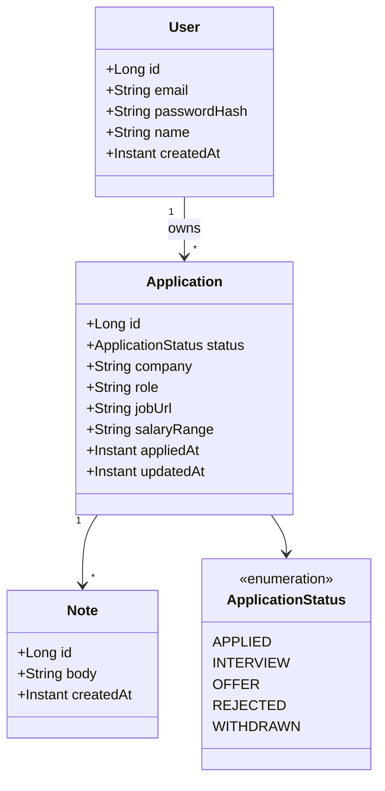
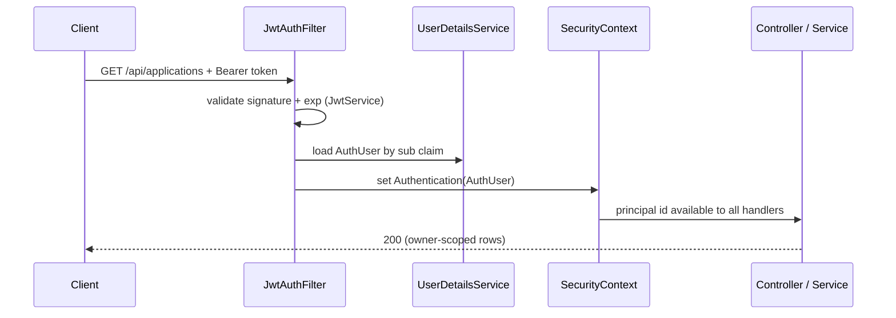

# jobtrack — architecture

## Stack

Java 21 · Spring Boot 3.4 · Maven · PostgreSQL · Spring Data JPA · Flyway ·
Spring Security (JWT) · Bean Validation · springdoc-openapi · Testcontainers

Package root: `com.salmanekhalili.jobtrack`

## 1. Domain model



Responsibilities:

- **User** — the authenticated principal; the only entity with world-readable
  identity (`id`, `email`) issued into the JWT.
- **Application** — one tracked job; carries all searchable/filterable fields.
- **Note** — free-form follow-up text attached to an application.

## 2. Package tree

```
com.salmanekhalili.jobtrack
├── JobTrackApplication
├── config            SecurityConfig, OpenApiConfig, logback JSON profile
├── web               AuthController, ApplicationController, NoteController,
│                     StatsController, ApiErrorHandler (@RestControllerAdvice)
├── security          JwtService, JwtAuthFilter, AuthUser, UserDetailsService
├── application       ApplicationService, NoteService, StatsService   (use-case layer)
├── domain            entities, ApplicationStatus, repository interfaces
├── dto               records: RegisterRequest, LoginRequest, AuthResponse,
│                     ApplicationDto, ApplicationRequest, NoteDto, StatsDto…,
│                     ErrorResponse
└── schedule          (present but intentionally empty — no background work)
```

Layering rule: `web → dto`, `web → application`, `application → domain`.
Controllers never touch repositories directly.

## 3. API surface

All `/api/**` endpoints require `Authorization: Bearer <jwt>` except the two
auth endpoints.

| Method | Path | Description |
| --- | --- | --- |
| POST | `/api/auth/register` | Create user, return token (201) |
| POST | `/api/auth/login` | Verify credentials, return token |
| GET | `/api/applications` | Pageable list; filters `status`, `company`, `from`, `to`; sortable |
| POST | `/api/applications` | Create application (201) |
| GET | `/api/applications/{id}` | Single application (404 if not owner/missing) |
| PUT | `/api/applications/{id}` | Full update |
| PATCH | `/api/applications/{id}` | Partial update / status change (optional) |
| DELETE | `/api/applications/{id}` | Delete + cascade notes |
| GET | `/api/applications/{id}/notes` | List notes for one application |
| POST | `/api/applications/{id}/notes` | Add note |
| PUT | `/api/notes/{id}` | Edit note |
| DELETE | `/api/notes/{id}` | Remove note |
| GET | `/api/stats` | Counts per status + total for current user |

Pagination contract: `GET /api/applications?page=0&size=20&sort=appliedAt,desc`.

Owner-scoping rule: read/write predicates include `application.user.id = :authId`
**in the JPQL/derived queries**, so even a bug in a controller can't leak another
user's rows.

## 4. Security flow



- Passwords: BCrypt (`BCryptPasswordEncoder`), never stored in plaintext.
- Token claims: `sub` = user id, `email`, `exp`; HMAC or RSA secret via config.
- `SecurityConfig` permits `/api/auth/**`, `/actuator/**`, swagger paths; rejects
  everything else. Stateless session, no CSRF (token auth).

## 5. Data / migrations

```
V1__create_users.sql         users table + unique email index
V2__create_applications.sql  applications + FK + indexes
V3__create_notes.sql         notes + FK + indexes
```

Indexes (as DDL in migrations, not implicit):

```
applications (user_id, applied_at)
applications (user_id, status)
notes (application_id)
```

## 6. Validation & errors

- Bean Validation on every request DTO: `@Email`, `@NotBlank`, `@Size`,
  `@Pattern` (user), `@NotNull` / `@PositiveOrZero` (fields that need it).
- `ApiErrorHandler` (`@RestControllerAdvice`) maps:
  - 400 → `MethodArgumentNotValidException`, `ConstraintViolationException`
  - 401 → bad/missing token
  - 404 → `ApplicationNotFoundException` / `NoteNotFoundException`
  - 409 → duplicate email on register
  - 500 → unexpected, logged, generic body (no stack traces leaked)
  - error shape: `{ "timestamp", "status", "error", "message", "path" }`

## 7. Testing

| Layer | Tool | What it proves |
| --- | --- | --- |
| Unit | JUnit 5 + Mockito | `JwtService` token round-trip, `StatsService` aggregation, validation rules |
| Unit | JUnit 5 + Mockito | service auth-owner checks (foreign id → exception) |
| Integration | Testcontainers Postgres | full happy path register→login→create→paginate→update→delete |
| Integration | Testcontainers Postgres | 401/403 on missing/bad token; cross-user isolation |

Run: `./mvnw verify`.

## 8. Delivery & ops

- `Dockerfile`: build stage (`maven:3.9-eclipse-temurin-21`) → runtime stage
  (`eclipse-temurin:21-jre` slim), non-root user, `ENTRYPOINT` java -jar.
- `docker-compose.yml`: `postgres` (healthcheck) + `app` (depends_on healthy,
  `HEALTHCHECK` → `/actuator/health`, env via `.env`).
- Actuator: `/actuator/health`, `/actuator/metrics`, `/actuator/info`.
- Logging: JSON via logback profile (`LOG_APPENDER=json`), request logging
  behind a small filter; correlation id generated per request.
- OpenAPI: springdoc with bearer-auth security scheme; Swagger at
  `/swagger-ui.html`.

## 9. Non-goals

- No microservices, message broker, CQRS, caching layer, or refresh tokens.
  Deliberately omitted: this project proves clean, testable, deployable
  horizontal-slice REST — not architectural fireworks.
- No UI. API + docs only.