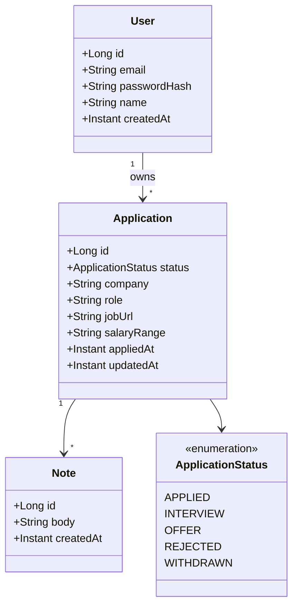
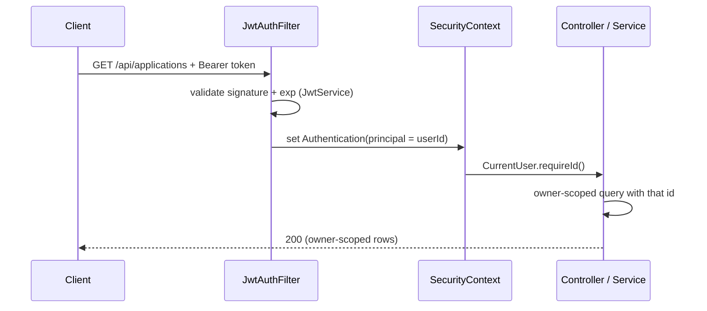

# jobtrack — architecture

## Stack

Java 21 · Spring Boot 4.1 · Maven · PostgreSQL 17 · Spring Data JPA · Flyway ·
Spring Security (JWT) · Bean Validation · springdoc-openapi · Testcontainers

Package root: `org.salmanekhalili.jobtrack`

## 1. Domain model


```mermaid
classDiagram
    class User {
        +Long id
        +String email
        +String passwordHash
        +String name
        +Instant createdAt
    }
    class ApplicationStatus {
        <<enumeration>>
        APPLIED
        INTERVIEW
        OFFER
        REJECTED
        WITHDRAWN
    }
    class Application {
        +Long id
        +ApplicationStatus status
        +String company
        +String role
        +String jobUrl
        +String salaryRange
        +Instant appliedAt
        +Instant updatedAt
    }
    class Note {
        +Long id
        +String body
        +Instant createdAt
    }
    User "1" --> "*" Application : owns
    Application "1" --> "*" Note
    Application --> ApplicationStatus
```

Responsibilities:

- **User** — the authenticated principal; the only entity with world-readable
  identity (`id`, `email`) issued into the JWT.
- **Application** — one tracked job; carries all searchable/filterable fields.
- **Note** — free-form follow-up text attached to an application.

Two lifecycle details worth knowing:

- `appliedAt` is client-settable. `@PrePersist` only defaults it to *now* when
  the caller left it out, because the `from`/`to` list filters range over it.
- Any status may follow any other. The enum documents the intended progression
  (`APPLIED → INTERVIEW → OFFER | REJECTED | WITHDRAWN`) but the API does not
  police it, so a mis-click is correctable. Use `PUT` to clear an optional
  field; in a `PATCH` an absent field means "leave it alone".

## 2. Package tree

```
org.salmanekhalili.jobtrack
├── JobtrackApplication
├── config            SecurityConfig, JwtAuthFilter, EncoderBean, OpenApiConfig,
│                     CorrelationIdFilter
├── web               AuthController, ApplicationController, NoteController,
│                     StatsController, ApiErrorHandler (@RestControllerAdvice)
├── security          JwtService, JsonErrorHandler, CurrentUser
├── service           AuthService, ApplicationService, NoteService, StatsService
├── domain            entities, ApplicationStatus, ApplicationFilter,
│                     ApplicationSpecifications, repository interfaces
├── exception         ApiException → NotFoundException → Application/NoteNotFound,
│                     EmailAlreadyRegistered, InvalidCredentials
└── dto               request/response records, PageResponse, ApiError
```

Layering rule: `web → dto`, `web → service`, `service → domain`. Controllers
never touch repositories. `domain` holds no security logic, but every query it
declares carries the owner id.

## 3. API surface

All `/api/**` endpoints require `Authorization: Bearer <jwt>` except the two
auth endpoints.

| Method | Path | Description |
| --- | --- | --- |
| POST | `/api/auth/register` | Create user, return token (201) |
| POST | `/api/auth/login` | Verify credentials, return token |
| GET | `/api/applications` | Pageable list; filters `status`, `company`, `from`, `to`; sortable |
| POST | `/api/applications` | Create application (201) |
| GET | `/api/applications/{id}` | Single application (404 if not owner/missing) |
| PUT | `/api/applications/{id}` | Full update |
| PATCH | `/api/applications/{id}` | Partial update / status change |
| DELETE | `/api/applications/{id}` | Delete + cascade notes (204) |
| GET | `/api/applications/{id}/notes` | List notes for one application |
| POST | `/api/applications/{id}/notes` | Add note (201) |
| PUT | `/api/notes/{id}` | Edit note |
| DELETE | `/api/notes/{id}` | Remove note (204) |
| GET | `/api/stats` | Counts per status + total for current user |

Pagination contract: `GET /api/applications?page=0&size=20&sort=appliedAt,desc`.
`size` defaults to 20 and is capped at 100 (`spring.data.web.pageable`).
`from`/`to` are inclusive `yyyy-MM-dd` UTC dates; `to` is widened to the start
of the next day so it includes everything applied that day.

Responses are a slim `PageResponse` rather than Spring's `Page`:

```json
{ "content": [ … ], "page": 0, "size": 20, "totalElements": 3,
  "totalPages": 1, "first": true, "last": true }
```

**Owner-scoping rule.** Every read and write of user data carries
`user.id = <authenticated id>` inside the query itself —
`findByIdAndUserId`, `findAllByApplicationIdAndApplicationUserId`,
`countByStatusForUser`, and the `ownedBy` specification that every list query
ANDs in first. A controller bug alone cannot widen that.

**Missing vs. foreign.** Both are `404` with the same body, so the API never
confirms that another user's id exists.

## 4. Security flow


```mermaid
sequenceDiagram
    participant C as Client
    participant F as JwtAuthFilter
    participant S as SecurityContext
    participant D as Controller / Service
    C->>F: GET /api/applications + Bearer token
    F->>F: validate signature + exp (JwtService)
    F->>S: set Authentication(principal = userId)
    S->>D: CurrentUser.requireId()
    D->>D: owner-scoped query with that id
    D-->>C: 200 (owner-scoped rows)
```

- Passwords: BCrypt (`EncoderBean`), never stored in plaintext.
- Token claims: `sub` = user id, `email`, `iat`, `exp`; HMAC-SHA256 key from
  `app.jwt.secret` (env `JWT_SECRET`, base64, 64 random bytes).
- The filter deliberately does **not** hit the database on each request: the
  signed `sub` claim is the identity. The trade-off is that a token issued
  before a user is deleted stays valid until it expires; nothing hangs off a
  deleted user because the owner-scoped queries return nothing.
- `SecurityConfig` permits `/api/auth/**`, `/actuator/**`, swagger paths;
  rejects everything else. Stateless session, no CSRF (token auth), no HTTP
  basic, no form login.
- 401/403 are rendered by `JsonErrorHandler` in the same `ApiError` shape
  as the controller advice, because that runs before any MVC machinery exists.
- Emails are lower-cased on the way in, and `V4` adds a `lower(email)` unique
  index so the same person cannot register `You@x.com` and `you@x.com`.

## 5. Data / migrations

```
V1__create_users.sql                    users table + unique email index
V2__create_applications.sql             applications + FK + indexes
V3__create_notes.sql                    notes + FK + indexes
V4__index_email_case_insensitive.sql    lower(email) unique index, company index
```

Indexes (as DDL in migrations, not implicit):

```
users        lower(email) unique
applications (user_id, applied_at)
applications (user_id, status)
applications (user_id, company)
notes        (application_id)
```

Hibernate runs with `ddl-auto: validate`, so the entities and the migrated
schema must agree or the application refuses to start. Flyway owns the schema.

## 6. Validation & errors

- Bean Validation on every request DTO: `@Email`, `@NotBlank`, `@Size`,
  `@Pattern` (URLs), `@PastOrPresent` (`appliedAt`). The `@Size` limits mirror
  the column widths exactly — without them an oversized value would come back
  as a 500 from Postgres instead of a 400 from the API.
- `ApiErrorHandler` (`@RestControllerAdvice`) maps:
  - 400 → `MethodArgumentNotValidException` (with per-field detail),
    `ConstraintViolationException`, unreadable body, bad query parameter, bad
    date, unknown `sort` field
  - 401 → missing/invalid/expired token (from the security filter chain)
  - 404 → `ApplicationNotFoundException` / `NoteNotFoundException`, unknown path
  - 409 → `EmailAlreadyRegisteredException`, and the unique-index violation that
    wins the race against the pre-check
  - 500 → anything else, logged with its stack trace, generic body
- Error shape:

```json
{ "timestamp": "2026-09-25T19:04:11.204Z", "status": 400,
  "error": "Bad Request", "message": "Validation failed",
  "path": "/api/applications", "fieldErrors": { "company": "Company cannot be empty." } }
```

`fieldErrors` is always present and empty when it does not apply, so clients
read one shape without null checks.

## 7. Testing

| Tier | Naming | Tool | What it proves |
| --- | --- | --- | --- |
| Unit | `*Test` | JUnit 5, Mockito, AssertJ | `JwtService` claims/expiry/forgery, `AuthService` hashing + normalisation, `StatsService` zero-fill, `CurrentUser` principal handling, owner checks in `ApplicationService`, DTO validation limits |
| Integration | `*IT` | Testcontainers Postgres + `TestRestTemplate` | full happy path register→login→CRUD→paginate→filter→notes→stats; 401 on missing/garbage/expired/foreign-key tokens; 409 duplicate email; 400 validation; cross-user isolation for applications, notes and statistics |

- `./mvnw test` — unit tier only, **no Docker required**.
- `./mvnw verify` — unit tier, then the integration tier via failsafe. Needs a
  working Docker daemon for Testcontainers. The Postgres image is pinned to
  `postgres:17-alpine`; a floating `latest` would eventually disagree with the
  migrated schema.
- If no Docker daemon is available, point the suite at a database you already
  have: `IT_DB_URL=jdbc:postgresql://host:5432/db ./mvnw verify`, with optional
  `IT_DB_USER` / `IT_DB_PASSWORD`. The suite registers a fresh user per test, so
  a long-lived database is fine.
- `src/test/resources/application.yml` sets
  `spring.docker.compose.skip.in-tests=true` so a test context never tries to
  start the development database as well. (In Boot 4 this is a nested flag, not
  a boolean.)

## 8. Observability

Deliberately application-side only. There is no `Dockerfile`, no `application-prod.yml`
and no CI in this repository; [`TODO.md`](TODO.md) specifies that layer and
explains why it was left out.

- Actuator: `/actuator/health`, `/actuator/metrics`, `/actuator/info`.
  Health details are `when-authorized`, so an unauthenticated probe gets a bare
  status and a logged-in user gets the component breakdown.
- Logging: `CorrelationIdFilter` generates or echoes `X-Request-Id`, puts it in
  the MDC for every log line the request produces, and rejects a hostile inbound
  value instead of echoing it. The error body carries the same id, so a 4xx in
  a log is traceable to the client's request.
- OpenAPI: springdoc with a bearer-auth scheme, so Swagger UI
  (`/swagger-ui.html`) has an "Authorize" button.

## 9. Known gaps

- No refresh tokens or revocation: a token is valid until `exp`.
- Status transitions are not enforced server-side.
- `PATCH` cannot clear a nullable field — use `PUT`.
- A note body is limited to 255 characters by the column; widening it needs a
  migration and a matching `@Size`.

## 10. Non-goals

- No microservices, message broker, CQRS, caching layer, or refresh tokens.
  Deliberately omitted: this project proves clean, testable horizontal-slice REST
  — not architectural fireworks.
- No UI. API + docs only.

---

## 11. curl reference

```bash
BASE=http://localhost:8080

# --- auth -------------------------------------------------------------------
curl -s -X POST $BASE/api/auth/register -H 'Content-Type: application/json' \
  -d '{"email":"you@example.com","name":"Salmane","password":"secret1234"}'

TOKEN=$(curl -s -X POST $BASE/api/auth/login -H 'Content-Type: application/json' \
  -d '{"email":"you@example.com","password":"secret1234"}' | jq -r .token)

AUTH="Authorization: Bearer $TOKEN"
JSON='Content-Type: application/json'

# --- applications -----------------------------------------------------------
ID=$(curl -s -X POST $BASE/api/applications -H "$AUTH" -H "$JSON" \
  -d '{"company":"Example GmbH","role":"Backend Engineer","jobUrl":"https://example.com/jobs/1"}' \
  | jq -r .id)

curl -s "$BASE/api/applications/$ID" -H "$AUTH"
curl -s "$BASE/api/applications?page=0&size=20&sort=appliedAt,desc" -H "$AUTH"
curl -s "$BASE/api/applications?status=INTERVIEW&company=example&from=2026-01-01&to=2026-12-31" -H "$AUTH"

curl -s -X PATCH $BASE/api/applications/$ID -H "$AUTH" -H "$JSON" \
  -d '{"status":"INTERVIEW"}'

curl -s -X PUT $BASE/api/applications/$ID -H "$AUTH" -H "$JSON" \
  -d '{"company":"Example GmbH","role":"Backend Engineer","status":"OFFER","salaryRange":"70-80k"}'

curl -s -X DELETE $BASE/api/applications/$ID -H "$AUTH" -i | head -1   # 204

# --- notes ------------------------------------------------------------------
NOTE=$(curl -s -X POST $BASE/api/applications/$ID/notes -H "$AUTH" -H "$JSON" \
  -d '{"body":"Phone screen on Tuesday"}' | jq -r .id)

curl -s "$BASE/api/applications/$ID/notes" -H "$AUTH"
curl -s -X PUT $BASE/api/notes/$NOTE -H "$AUTH" -H "$JSON" -d '{"body":"Moved to Friday"}'
curl -s -X DELETE $BASE/api/notes/$NOTE -H "$AUTH" -i | head -1        # 204

# --- stats, health, docs ----------------------------------------------------
curl -s $BASE/api/stats -H "$AUTH"
curl -s $BASE/actuator/health
open http://localhost:8080/swagger-ui.html
```
