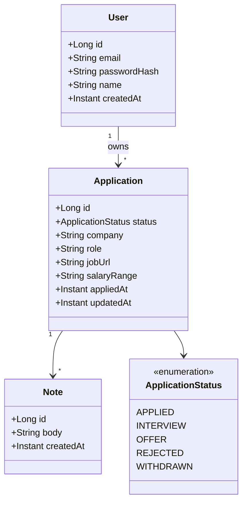
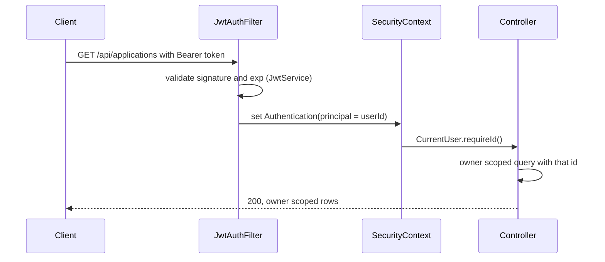

# jobtrack: architecture

Java 21, Spring Boot 4.1.1, Maven, PostgreSQL 17, Spring Data JPA, Flyway,
Spring Security with JWT, Bean Validation, springdoc-openapi, Testcontainers.

Package root: `org.salmanekhalili.jobtrack`

## 1. Domain


```mermaid
classDiagram
    class User {
        +Long id
        +String email
        +String passwordHash
        +String name
        +Instant createdAt
    }
    class ApplicationStatus {
        <<enumeration>>
        APPLIED
        INTERVIEW
        OFFER
        REJECTED
        WITHDRAWN
    }
    class Application {
        +Long id
        +ApplicationStatus status
        +String company
        +String role
        +String jobUrl
        +String salaryRange
        +Instant appliedAt
        +Instant updatedAt
    }
    class Note {
        +Long id
        +String body
        +Instant createdAt
    }
    User "1" --> "*" Application : owns
    Application "1" --> "*" Note
    Application --> ApplicationStatus
```

- `User` is the principal. Only `id` and `email` are world readable, and only
  they go into the JWT.
- `Application` holds every searchable and filterable field.
- `Note` is free text attached to an application.

Two lifecycle details:

- `appliedAt` is client settable. `@PrePersist` defaults it to now only when the
  caller left it out, because the `from` and `to` filters range over it.
- Any status may follow any other. `PUT` clears an optional field; in a `PATCH`
  an absent field means leave it alone.

## 2. Packages

```
org.salmanekhalili.jobtrack
├── JobtrackApplication
├── config      SecurityConfig, JwtAuthFilter, EncoderBean, OpenApiConfig,
│               CorrelationIdFilter
├── web         AuthController, ApplicationController, NoteController,
│               StatsController, ApiErrorHandler
├── security    JwtService, JsonErrorHandler, CurrentUser
├── service     AuthService, ApplicationService, NoteService, StatsService
├── domain      entities, ApplicationStatus, ApplicationFilter,
│               ApplicationSpecifications, repository interfaces
├── exception   ApiException, NotFoundException, Application/NoteNotFound,
│               EmailAlreadyRegistered, InvalidCredentials
└── dto         request and response records, PageResponse, ApiError
```

Layering: `web` calls `dto` and `service`, `service` calls `domain`.
Controllers never touch repositories. `domain` holds no security logic, but
every query it declares carries the owner id.

## 3. API

Everything under `/api/**` needs `Authorization: Bearer <jwt>` except the two
auth endpoints.

| Method | Path | Description |
| --- | --- | --- |
| POST | `/api/auth/register` | Create user, return token (201) |
| POST | `/api/auth/login` | Verify credentials, return token |
| GET | `/api/applications` | List. Filters: `status`, `company`, `from`, `to` |
| POST | `/api/applications` | Create (201) |
| GET | `/api/applications/{id}` | Single, 404 if missing or not owned |
| PUT | `/api/applications/{id}` | Full update |
| PATCH | `/api/applications/{id}` | Partial update |
| DELETE | `/api/applications/{id}` | Delete, cascades notes (204) |
| GET | `/api/applications/{id}/notes` | Notes for one application |
| POST | `/api/applications/{id}/notes` | Add note (201) |
| PUT | `/api/notes/{id}` | Edit note |
| DELETE | `/api/notes/{id}` | Remove note (204) |
| GET | `/api/stats` | Counts per status plus total, for the current user |

Pagination: `GET /api/applications?page=0&size=20&sort=appliedAt,desc`. Default
size 20, capped at 100. `from` and `to` are inclusive `yyyy-MM-dd` UTC dates,
and `to` widens to the start of the next day so it covers everything applied
that day.

Lists return a slim `PageResponse`, not Spring's `Page`:

```json
{ "content": [ "…" ], "page": 0, "size": 20, "totalElements": 3,
  "totalPages": 1, "first": true, "last": true }
```

**Owner scoping.** The owner id lives inside the query:
`findByIdAndUserId`, `findAllByApplicationIdAndApplicationUserId`,
`countByStatusForUser`, and the `ownedBy` specification that every list query
ANDs in first. A controller bug alone cannot widen it.

**Missing and foreign are both 404** with the same body, so the API never
confirms that another user's id exists.

## 4. Security


```mermaid
sequenceDiagram
    participant C as Client
    participant F as JwtAuthFilter
    participant S as SecurityContext
    participant D as Controller
    C->>F: GET /api/applications with Bearer token
    F->>F: validate signature and exp (JwtService)
    F->>S: set Authentication(principal = userId)
    S->>D: CurrentUser.requireId()
    D->>D: owner scoped query with that id
    D-->>C: 200, owner scoped rows
```

- Passwords: BCrypt (`EncoderBean`).
- Claims: `sub` (user id), `email`, `iat`, `exp`. HMAC-SHA256 keyed from
  `app.jwt.secret` (env `JWT_SECRET`, base64).
- The filter does not hit the database per request; the signed `sub` claim is
  the identity. A token issued before a user is deleted stays valid until it
  expires, and nothing hangs off a deleted user because owner scoped queries
  return nothing.
- `SecurityConfig` permits `/api/auth/**`, `/actuator/**` and the swagger paths.
  Stateless session, no CSRF (token auth), no HTTP basic, no form login.
- `JsonErrorHandler` renders 401 and 403 in the same `ApiError` shape as the
  controller advice, because the filter chain runs before any MVC machinery.
- Emails are lower cased on the way in. `V4` adds a `lower(email)` unique
  index, so `You@x.com` and `you@x.com` cannot both register.

## 5. Data

```
V1__create_users.sql                    users, unique email index
V2__create_applications.sql             applications, FK, indexes
V3__create_notes.sql                    notes, FK, indexes
V4__index_email_case_insensitive.sql    lower(email) unique, company index
```

Indexes, all explicit DDL:

```
users        lower(email) unique
applications (user_id, applied_at)
applications (user_id, status)
applications (user_id, company)
notes        (application_id)
```

Flyway owns the schema. Hibernate runs `ddl-auto: validate` and refuses to
start on any mismatch between the entities and the migrations.

## 6. Errors

Bean Validation on every request DTO: `@Email`, `@NotBlank`, `@Size`,
`@Pattern` for URLs, `@PastOrPresent` on `appliedAt`. The `@Size` limits match
the column widths exactly, so an oversized value is a 400 from the API instead
of a 500 from Postgres.

`ApiErrorHandler` maps:

- 400: `MethodArgumentNotValidException` with per field detail,
  `ConstraintViolationException`, unreadable body, bad query parameter, bad
  date, unknown `sort` field
- 401: missing, invalid or expired token, from the security filter chain
- 404: `ApplicationNotFoundException`, `NoteNotFoundException`, unknown path
- 409: `EmailAlreadyRegisteredException`, plus the unique index violation that
  wins the race against the pre check
- 500: anything else, logged with its stack trace, generic body

```json
{ "timestamp": "2026-09-25T19:04:11.204Z", "status": 400,
  "error": "Bad Request", "message": "Validation failed",
  "path": "/api/applications",
  "fieldErrors": { "company": "Company cannot be empty." } }
```

`fieldErrors` is always present and empty when it does not apply, so clients
read one shape without null checks.

## 7. Tests

| Tier | Naming | Tools |
| --- | --- | --- |
| Unit | `*Test` | JUnit 5, Mockito, AssertJ |
| Integration | `*IT` | Testcontainers Postgres, `TestRestTemplate` |

Unit tier covers `JwtService` claims, expiry and forgery; `AuthService` hashing
and normalisation; `StatsService` zero fill; `CurrentUser` principal handling;
owner checks in `ApplicationService`; DTO validation limits.

Integration tier covers register, login, CRUD, pagination, filters, notes,
stats, the 401 and 409 cases above, and cross-user isolation for applications,
notes and statistics.

- `./mvnw test` runs the unit tier only, no Docker required.
- `./mvnw verify` adds the integration tier via failsafe. Needs a Docker daemon
  for Testcontainers unless `IT_DB_URL` is set. The image is pinned to
  `postgres:17-alpine`; a floating `latest` would eventually disagree with the
  migrated schema.
- `IT_DB_URL`, `IT_DB_USER` and `IT_DB_PASSWORD` point the suite at a database
  you already have. Each test registers a fresh user, so a long lived database
  is fine.
- `src/test/resources/application.yml` sets
  `spring.docker.compose.skip.in-tests: true` so a test context never starts
  the development database as well. Boot 4 makes this a nested flag, not a
  boolean.

## 8. Observability

No Dockerfile, no `application-prod.yml`, no CI in this repository.
[TODO.md](TODO.md) specifies that layer.

- Actuator: `/actuator/health`, `/actuator/metrics`, `/actuator/info`. Health
  details are `when-authorized`, so an unauthenticated probe gets a bare status.
- `CorrelationIdFilter` generates or echoes `X-Request-Id`, puts it in the MDC
  for every log line the request produces, and rejects a hostile inbound value
  instead of echoing it. The error body carries the same id.
- OpenAPI via springdoc with a bearer auth scheme, so Swagger UI has an
  Authorize button.

## 9. Known gaps

- No refresh tokens or revocation. A token is valid until `exp`.
- Status transitions are not enforced server side.
- `PATCH` cannot clear a nullable field. Use `PUT`.
- Note body is capped at 255 characters by the column. Widening it needs a
  migration and a matching `@Size`.

## 10. Non-goals

- No microservices, message broker, CQRS, caching layer or refresh tokens.
- No UI. API and docs only.

## 11. curl reference

```bash
BASE=http://localhost:8080
JSON='Content-Type: application/json'

# auth
curl -s -X POST $BASE/api/auth/register -H "$JSON" \
  -d '{"email":"you@example.com","name":"Salmane","password":"secret1234"}'

TOKEN=$(curl -s -X POST $BASE/api/auth/login -H "$JSON" \
  -d '{"email":"you@example.com","password":"secret1234"}' | jq -r .token)
AUTH="Authorization: Bearer $TOKEN"

# applications
ID=$(curl -s -X POST $BASE/api/applications -H "$AUTH" -H "$JSON" \
  -d '{"company":"Example GmbH","role":"Backend Engineer","jobUrl":"https://example.com/jobs/1"}' \
  | jq -r .id)

curl -s "$BASE/api/applications/$ID" -H "$AUTH"
curl -s "$BASE/api/applications?page=0&size=20&sort=appliedAt,desc" -H "$AUTH"
curl -s "$BASE/api/applications?status=INTERVIEW&company=example&from=2026-01-01&to=2026-12-31" -H "$AUTH"

curl -s -X PATCH $BASE/api/applications/$ID -H "$AUTH" -H "$JSON" \
  -d '{"status":"INTERVIEW"}'

curl -s -X PUT $BASE/api/applications/$ID -H "$AUTH" -H "$JSON" \
  -d '{"company":"Example GmbH","role":"Backend Engineer","status":"OFFER","salaryRange":"70-80k"}'

curl -s -X DELETE $BASE/api/applications/$ID -H "$AUTH" -i | head -1

# notes
NOTE=$(curl -s -X POST $BASE/api/applications/$ID/notes -H "$AUTH" -H "$JSON" \
  -d '{"body":"Phone screen on Tuesday"}' | jq -r .id)

curl -s "$BASE/api/applications/$ID/notes" -H "$AUTH"
curl -s -X PUT $BASE/api/notes/$NOTE -H "$AUTH" -H "$JSON" -d '{"body":"Moved to Friday"}'
curl -s -X DELETE $BASE/api/notes/$NOTE -H "$AUTH" -i | head -1

# stats, health, docs
curl -s $BASE/api/stats -H "$AUTH"
curl -s $BASE/actuator/health
open http://localhost:8080/swagger-ui.html
```
